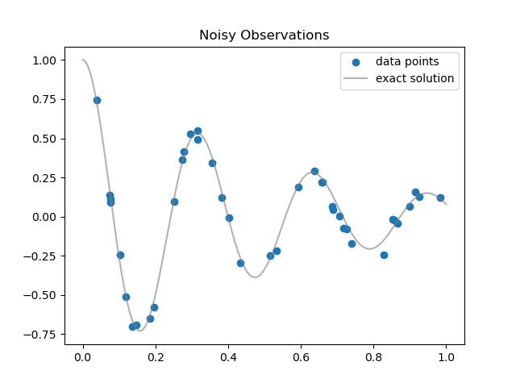
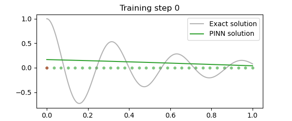
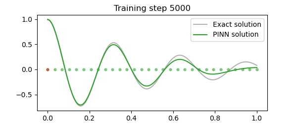
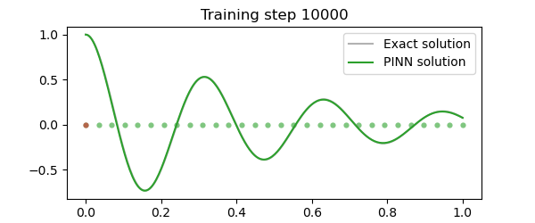
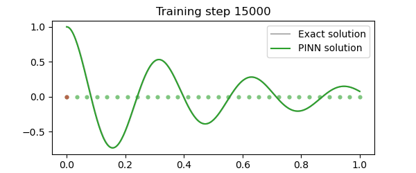
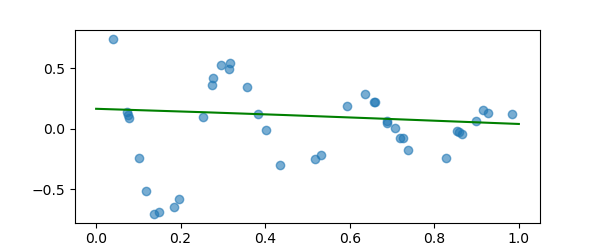
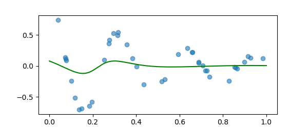
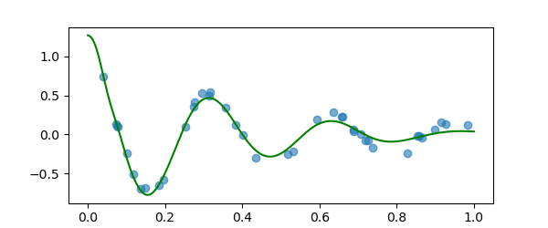
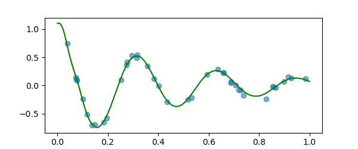

<h1>Physics-Informed Neural Network (PINN)</h1>

This repository contains the implementation of a Physics-Informed Neural Network (PINN) following the <a href="https://www.youtube.com/watch?v=G_hIppUWcsc">YouTube tutorial by Kourosh</a>.

<h2>Overview</h2>

Physics-Informed Neural Networks (PINNs) use physical laws described by PDEs to inform the learning process, combining data-driven and physics-informed loss functions.

<h2>Requirements</h2>
<ul>
    <li>Python 3.x</li>
    <li>PyTorch</li>
    <li>NumPy</li>
    <li>Matplotlib</li>
</ul>

Install the dependencies with:

<pre><code>pip install torch numpy matplotlib</code></pre>

<h2>Usage</h2>
<ol>
    <li>Clone the repository:
        <pre><code>git clone https://github.com/yourusername/pinn-implementation.git
cd pinn-implementation</code></pre>
    </li>
    <li>Run the main script:
        <pre><code>python harmonic-oscillator-using-pinns.ipynb</code></pre>
    </li>
</ol>

<h2>Project Structure</h2>
<ul>
    <li><code>harmonic-oscillator-using-pinns.ipynb</code>: Main script for training and visualization.</li>
</ul>

<h2>Synthetic Observations</h2>

<h2>Training Loop</h2>

<h2>References</h2>
<ul>
    <li><a href="https://www.youtube.com/watch?v=G_hIppUWcsc">YouTube Video by Kourosh</a></li>
    <li><a href="https://arxiv.org/abs/1711.10561">PINNs Paper</a></li>
    <li><a href="https://github.com/benmoseley/harmonic-oscillator-pinn-workshop/tree/main">PINNs Workshop</a></li>
</ul>

<h2>License</h2>

This project is licensed under the MIT License.

